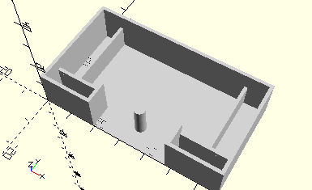

# FrameToothedTileBarWithControlLinks
Zahnspurstange mit zwei Lenkhebeln.
- 38472
- 38473



Die Zahnspurstange wird montiert mit den zwei Lenkhebeln im Rahmen abgelegt. Siehe Fischertechnik 50/2.

## Use
```
use <../Elements/FrameToothedTileBarWithControlLinks.scad>
```

## Syntax
```
FrameToothedTileBarWithControlLinks();

space = getFrameToothedTileBarWithControlLinksSpace();
```

## Rückgabewert getFrameToothedTileBarWithControlLinksSpace
Fläche als \[x,y]-Liste