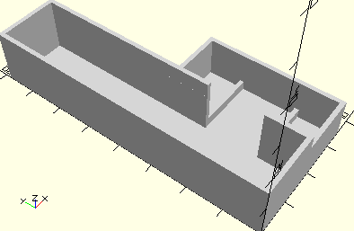

# FrameTrailSensor
Spursensor mit Kabeln.
- 128598



Für die montierten Kabel ist eine Box mit Kabeldurchlass angebracht.

## Use
```
use <../Elements/FrameTrailSensor.scad>
```

## Syntax
```
FrameTrailSensor();

space = getFrameTrailSensorSpace();
```

## Rückgabewert getFrameTrailSensorSpace
Fläche als \[x,y]-Liste