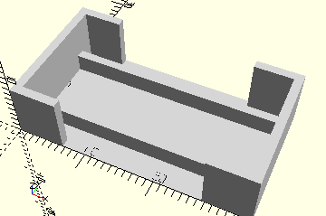

# FrameTransistorBlock
Montierter Transistorbaustein aus PROFI Electronics (Transistor BC 547 C).
- 152059
- 152218
- 152860



## Use
```
use <../Elements/FrameTransistorBlock.scad>
```

## Syntax
```
FrameTransistorBlock();

space = getFrameTransistorBlockSpace();
```

## Rückgabewert getFrameTransistorBlockSpace
Fläche als \[x,y]-Liste