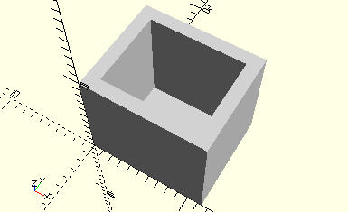

# FrameTwoConnectors15
Zwei Verbinder 15.
- 31060



Die zwei Verbinder 15 werden senkrecht nebeneinander in den Rahmen gesteckt.

## Use
```
use <../Elements/FrameTwoConnectors15.scad>
```

## Syntax
```
FrameTwoConnectors15();

space = getFrameTwoConnectors15Space();
```

## Rückgabewert getFrameTwoConnectors15Space
Fläche als \[x,y]-Liste