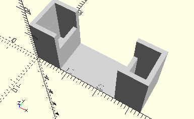

# FrameTwoConnectors30
beschreibung.
- 31061



Die beiden Verbinder 30 werden nebeneinander in den Rahmen gelegt.

## Use
```
use <../Elements/FrameTwoConnectors30.scad>
```

## Syntax
```
FrameTwoConnectors30();

space = getFrameTwoConnectors30Space();
```

## Rückgabewert getFrameTwoConnectors30Space
Fläche als \[x,y]-Liste