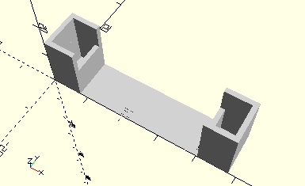

# FrameTwoConnectors45
Zwei Verbinder 45.
- 31330



Die beiden Verbinder 45 werden nebeneinander in den Rahmen gelegt

## Use
```
use <../Elements/FrameTwoConnectors45.scad>
```

## Syntax
```
FrameTwoConnectors45();

space = getFrameTwoConnectors45Space();
```

## Rückgabewert getFrameTwoConnectors45Space
Fläche als \[x,y]-Liste