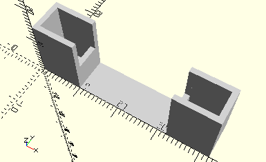

# FrameTwoStrut30
I-Strebe 30 mit Loch.
- 38537
- 38538
- 160545



Die beiden I-Streben 30 werden nebeneinander in den Rahmen gelegt. Dieses Element ist sinnvoll für Baukästen, in denen genau zwei dieser I-Streben enthalten sind.

## Use
```
use <../Elements/FrameTwoStrut30.scad>
```

## Syntax
```
FrameTwoStrut30();

space = getFrameTwoStrut30Space();
```

## Rückgabewert getFrameTwoStrut30Space
Fläche als \[x,y]-Liste