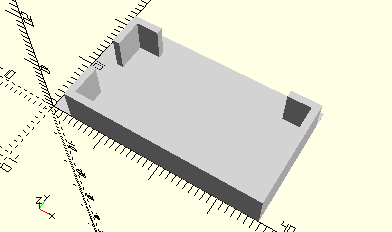

# FrameUFormGearbox
U-Getriebe für Minimotor.
- 31068
- 31078



## Use
```
use <../Elements/FrameUFormGearbox.scad>
```

## Syntax
```
FrameUFormGearbox();

space = getFrameUFormGearboxSpace();
```

## Rückgabewert getFrameUFormGearboxSpace
Fläche als \[x,y]-Liste