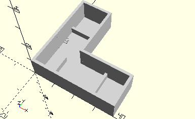

# FrameUniversalJointCardan
Kardangelenk mit zwei Spannzangen.
- 31044
- 35113



Das Element ist vorgesehen für eine Kardangelenk, das mit zwei Spannzangen (35113) montiert ist.

## Use
```
use <../Elements/FrameUniversalJointCardan.scad>
```

## Syntax
```
FrameUniversalJointCardan();

space = getFrameUniversalJointCardanSpace();
```

## Rückgabewert getFrameUniversalJointCardanSpace
Fläche als \[x,y]-Liste. Gerechnet werden die beiden langen Seiten für x und y.