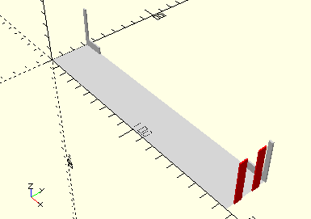
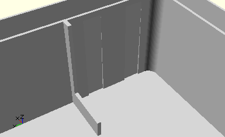
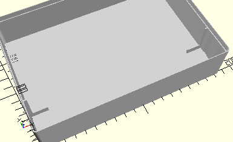

# HolderBatterySet
Batteriestab.
- 31041



__ACHTUNG__: Der Batteriestab passt nicht ganz in einen Sortierkasten 190 x 130. Dazu müssen zwei Aussparungen in die Außenwand des Kastens gemacht werden. Dafür ist das Modul __HolderBattarySetCutoffs()__ gedacht. Im Bild oben sind dies die zwei roten Streifen. Siehe dazu das Beispiel unten. Auch im Originalkasten mot1 sind diese Aussparungen vorhanden.

## Use
```
use <../Elements/HolderBatterySet.scad>
```

## Syntax
```
HolderBatterySet();

space = getHolderBatterySetSpace();
```

## Rückgabewert getHolderBatterySetSpace
Fläche als \[x,y]-Liste

## Beispiel
```
use <../../Base/Placement.scad>
use <../../Base/Boxes.scad>
use <../../Elements/HolderBatterySet.scad>

include <../../Base/PlacementOptions.scad>

color("lightgray")
{
    difference() {
        Box190();
        HolderBatterySetCutoffs();
    }
    HolderBatterySet();
}
```
Die zwei notwendigen Ausschnitte in der Wand werden am rechten Ende durch __difference()__ mit der [__Box190__](../Base/Box190.md) erzeugt:



Das Gesamtergebnis:

