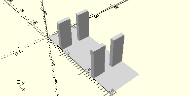
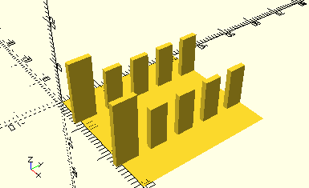

# HolderBuildingPlate30x30
Bauplatte 30x39.
- 31501
- 38266
- 38259
- 146534



## Use
```
use <../Elements/HolderBuildingPlate30x30.scad>
```

## Syntax
```
HolderBuildingPlate30x30(
    count=1,
    dock=false);

space = getHolderBuildingPlate30x30Space(
    count=1);
```

| Parameter | Typ | Beschreibung |
| ------ | ------ | ------ |
| count | Integer | Anzahl der Bauplatten hintereinander. |
| dock | Boolean | __true__, wenn die Halterungen an die Wand des Sortierkastens angedockt werden sollen. Die der Wand zugewandten Stege sind dann höher und ragen zum Verschmelzen in die Wand hinein. Dazu muss das Element mit der Seite direkt an der Wand platziert werden (z.B. per [__Place__](../Base/Place.md) mit __Rotate90__ und __AlignLeft__). |

## Rückgabewert getHolderBuildingPlate30x30Space
Fläche als \[x,y]-Liste

## Beispiel
```
use <../../Elements/HolderBuildingPlate30x30.scad>

HolderBuildingPlate30x30(4, true);
```


