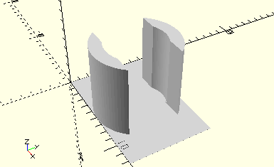

# HolderBulbLamp
Kugelstecklampe oder Linsenstecklampe.
- 37869
- 37875

Halterung für einzelne Stecklampe.



## Use
```
use <../Elements/HolderBulbLamp.scad>
```

## Syntax
```
HolderBulbLamp();

space = getHolderBulbLampSpace();
```

## Rückgabewert getHolderBulbLampSpace
Fläche als \[x,y]-Liste