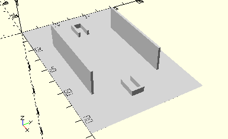

# HolderCompleteBucket
Schaufelseiten rechts/links und drei Schaufelzwischenteile, zusammengehalten von Flügelachse 75x4.
- 37353
- 37354
- 37355
- 38257



## Use
```
use <../Elements/HolderCompleteBucket.scad>
```

## Syntax
```
HolderCompleteBucket();

space = getHolderCompleteBucketSpace();
```

## Rückgabewert getHolderCompleteBucketSpace
Fläche als \[x,y]-Liste