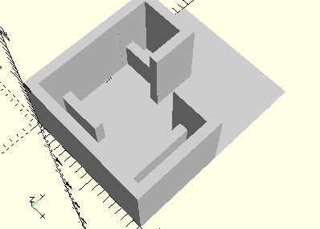

# HolderGearSupportWithWorm
Getriebehalter mit Schnecke m 0,5 für Mini-Motor (mini-mot 1).
- 31069



## Use
```
use <../Elements/HolderGearSupportWithWorm.scad>
```

## Syntax
```
HolderGearSupportWithWorm();

space = getHolderGearSupportWithWormSpace();
```

## Rückgabewert getHolderGearSupportWithWormSpace
Fläche als \[x,y]-Liste