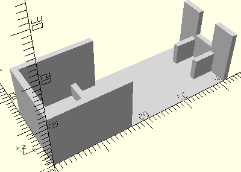

# HolderLiftingJoint
Hubgelenk für Mini-Motor Hubstange.
- 37282



## Use
```
use <../Elements/HolderLiftingJoint.scad>
```

## Syntax
```
HolderLiftingJoint();

space = getHolderLiftingJointSpace();
```

## Rückgabewert getHolderLiftingJointSpace
Fläche als \[x,y]-Liste