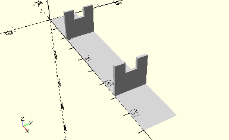

# HolderLinkBeam
Lenkbalken.
- 38418



## Use
```
use <../Elements/HolderLinkBeam.scad>
```

## Syntax
```
HolderLinkBeam();

space = getHolderLinkBeamSpace();
```

## Rückgabewert getHolderLinkBeamSpace
Fläche als \[x,y]-Liste