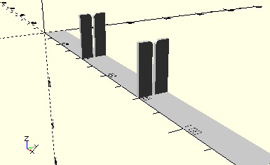

# HolderMirrorBand
Spiegelband.
- 31370

Die beiden Halterungen sind 40 mm vom jeweiligen Rand entfernt. Diese Abstände können über die beiden Parameter *xLeft* und *xRight* angepasst werden. Im ec3 ist *xRight*



## Use
```
use <../Elements/HolderMirrorBand.scad>
```

## Syntax
```
HolderMirrorBand(
    xLeft=-1,
    xRight=-1);

space = get$HolderMirrorBandSpace();
```

| Parameter | Typ | Beschreibung |
| ------ | ------ | ------ |
| xLeft | Decimal | X-Offset des ersten Halters relativ zum linken Rand. Standardwert ist -1, 40 mm von links. |
| xRight | Decimal | X-Offset des zweiten Halters relativ zum rechten Rand. Standardwert ist -1, 40 mm von rechts.|

## Rückgabewert getHolderMirrorBandSpace
Fläche als \[x,y]-Liste