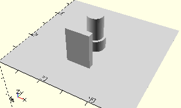

# HolderPropellerFourBlades
Propeller mit vier Blättern.
- 36337

Der Propeller wird in X-Ausrichtung auf die Achse gesteckt. Der Steg hält die Position des Propellers in X-Ausrichtung.



## Use
```
use <../Elements/HolderPropellerFourBlades.scad>
```

## Syntax
```
HolderPropellerFourBlades();

space = getHolderPropellerFourBladesSpace();
```

## Rückgabewert getHolderPropellerFourBladesSpace
Fläche als \[x,y]-Liste