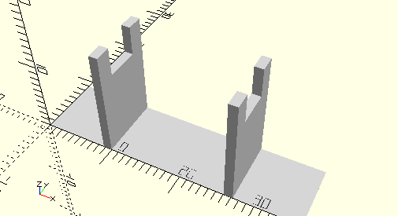

# HolderSpringLeg
Federfuß.
- 31307



Mehrere Federfüße werden nebeneinander in die Halterung gelegt. Die Anzahl muss in *count* angegeben werden.

## Use
```
use <../Elements/HolderSpringLeg.scad>
```

## Syntax
```
HolderSpringLeg(
    count=1,
    dock=false);

space = get$HolderSpringLegSpace(
    count=1);
```

| Parameter | Typ | Beschreibung |
| ------ | ------ | ------ |
| count | Integer | Anzahl der Federfüße nebeneinander. |
| dock | Boolean | __true__ wenn der vordere Halter in die Wand des Sortierkastens verlängert wird, um damit zu verschmelzen. Bei Bedarf muss das Element dann beim Platzieren noch gedreht werden. |

## Rückgabewert getHolderSpringLegsSpace
Fläche als \[x,y]-Liste