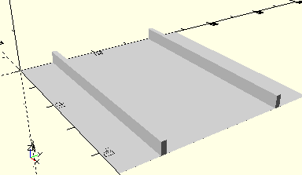

# HolderTire45
Reifen 45.
- 31018



Zwei parallele Stege zum Auflegen des Reifens. Diese sollten noch von Wänden begrenzt werden wie in den Kästen 50 oder 50/1. Die Reifen können auch mit Flachnaben montiert sein.

## Use
```
use <../Elements/HolderTire45.scad>
```

## Syntax
```
HolderTire45(
    count=1,
    height=3);

space = get$HolderTire45Space(
    count=1,
    height=3);
```

| Parameter | Typ | Beschreibung |
| ------ | ------ | ------ |
| count | Integer | Anzahl der Reifen. Die zahl bestimmt die Länge der Stege. In einer Box 190 können maximal vier Reifen nebeneinander gelegt werden. |
| height | Decimal | Höhe der Stege. Im Kasten 50 sind dies 3 mm, in 50/1 6 mm. Standardwert ist 3. |

## Rückgabewert getHolderTire45Space
Fläche als \[x,y]-Liste