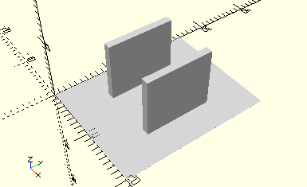

# HolderWinchDrum
Seiltrommel.
- 31016



## Use
```
use <../Elements/HolderWinchDrum.scad>
```

## Syntax
```
HolderWinchDrum();

space = getHolderWinchDrumSpace();
```

## Rückgabewert getHolderWinchDrumSpace
Fläche als \[x,y]-Liste