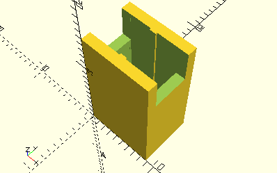

# AxisMiddleSupport

Erzeugt eine mittlere Stütze für Achsen.



Das Element wird z.B. von [__FrameConnectingRod30__](../Elements/FrameConnectingRod30.md) verwendet.

## Use
```
use <../ModelBase/Complex.scad>
```

## Syntax
```
AxisMiddleSupport(
    length=8, 
    height=getFrameAxisHeight());
```

| Parameter | Typ | Beschreibung |
| ------ | ------ | ------ |
| length | Decimal | Exakte Länge des Elements. Es wird keine Toleranz addiert. |
| height | Decimal | Höhe des Elements. Standard ist die Höhe von Achshaltern wie [__FrameAxis30__](../Elements/FrameAxis30.md). |
