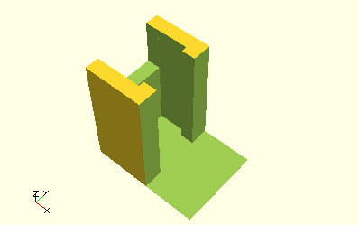
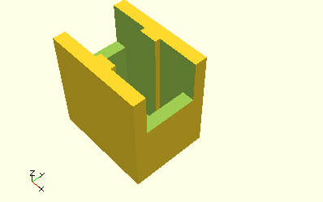

# ElevatedFramesWithCutoff

Erzeugt eine Halterung, die im Normalfall für einzelne Achsen verwendet wird.


Die Halterung besteht aus zwei Rahmen an den Enden, jeweils mit einer Aussparung für das jeweilige Ende des Bauteils. Die Aussparung ist in der Standardeinstellung durch eine Wand abgeschlossen. Über Parameter können diese Abschlusswände auch weggelassen werden. Das Modul __ElevatedFramesWithCutoff__ wird vom ModelBase-Modul [__FrameAxis__](FrameAxis.md) verwendet. __FrameAxis__ verwendet für einige der hier aufgeführten Parameter Standardwerte, u.a. die Achsdurchmesser und eine konstante Höhe der Halterungen.

## Use
```
use <../ModelBase/Complex.scad>
```

## Syntax
```
ElevatedFramesWithCutoff(
  volume, 
  depth,
  height, 
  bearingLength, 
  cutThrough=false);
```

| Parameter | Typ | Beschreibung |
| ------ | ------ | ------ |
| volume | \[x,y,z] | Volumen des Bauelements, welches in dem Rahmen passen soll. Für eine Achse ist die die Achslänge als X-Wert, und der Durchmesser für Tiefe und Höhe. |
| depth | Decimal | Jeweilige Tiefe der beiden Halterungsrahmen. Der Ausschnitt wird dann mittig in der notwendigen Breite für *volume.y* gesetzt. *depth* gibt also an, wie viel noch neben dem Ausschnitt an Wandlänge stehen bleibt und sollte ein wenig mehr als den Achsdurchmesser betragen. |
| height | Decimal | Jeweilige Höhe der beiden Halterungsrahmen. |
| bearingLenght | Decimal | Jeweilige Länge der beiden Halterungsrahmen. Bei Achsen sollte diese weniger als die Hälfte der Achslänge betragen. |
| cutThrough | Boolean | __true__, wenn die Wand am Ende der beiden Halterungen weggelassen werden soll. |
| clampThrough | Boolean | __true__, wenn die komplette Wand am etwas enegeren Einlass der Achse bis zum Boden entfernt werden soll. Das wird intern vom Modul [__AxisMiddleSupport__](AxisMiddleSupport.md) verwendet. |

## Beispiele

### Breite und Höhe der Auflage individuell angeben
```
use <../../Base/Constants.scad>
use <../../ModelBase/Complex.scad>

ElevatedFramesWithCutoff([40, 20, 15], depth=20, height=20, bearingLength=10);
```


### Wand bis zum Boden entfernen
```
use <../../Base/Constants.scad>
use <../../ModelBase/Complex.scad>

ElevatedFramesWithCutoff([9, 4, 4], 5, 10, 4, cutThrough=true, single=true, clampThrough=true);
```



### Mittlere Halterung
```
use <../../Base/Constants.scad>
use <../../ModelBase/Complex.scad>

ElevatedFramesWithCutoff([9, 4, 4], 5, 10, 4, cutThrough=true, single=false, clampThrough=true);
```


