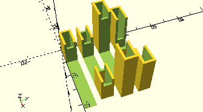

# FrameAxis

Erzeugt eine Achshalterung für eine Achse mit der angegebenen Länge.


Die Halterung besteht aus zwei Rahmen an den Enden, jeweils mit einer Aussparung für das jeweilige Ende des Bauteils. Die Aussparung ist in der Standardeinstellung durch eine Wand abgeschlossen. Über den Parameter *cutThrough* können diese Abschlusswände auch weggelassen werden.

__FrameAxis__ verwendet as Modul __ElevatedFramesWithCutoff__ mit einer Reihe von konstanten Parametern, die für die 4 mm Achsen passen.

## Use
```
use <../ModelBase/Complex.scad>
```

## Syntax
```
FrameAxis(
  length, 
  count=1,
  cutThrough=false,
  height=getFrameAxisHeight(),
  single=false);
```

| Parameter | Typ | Beschreibung |
| ------ | ------ | ------ |
| length | Decimal | Länge der Achse. |
| count | Integer | Anzahl der Achsen übereinander. Ab 3 Achsen erhöht sich die Gesamthöhe jeweils um den Durchmesser einer Achse. |
| cutThrough | Boolean | __true__, wenn die Wand am Ende der beiden Halterungen weggelassen werden soll. |
| height | Decimal | Höhe der Achshalter. Standard ist 15,0. Wenn *count* größer 2 ist, erhöht sich die Höhe automatisch um jeweils den Durchmesser einer Achse ((*count*-2) * Achsendurchmesser). Die Höhe kann über [__getFrameAxisHeight__](getFrameAxisHeight.md) durch Übergabe des Parameters *count* ermittelt werden. |
| single | Boolean | __true__, wenn nur ein Halter auf einer Seite erzeugt werden soll. |

## Beispiele

```
use <../../Base/Constants.scad>
use <../../ModelBase/Complex.scad>
 
FrameAxis(40, single=true);
translate([0, 10])
    FrameAxis(40, cutThrough=true);
translate([0, 20])
    FrameAxis(40, height=30);
translate([0, 30])
    FrameAxis(40, count=4);
```

