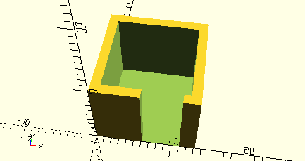

# FrameBottomCutoff

Erzeugt einen Kubus, der mit __difference__ einen Ausschnitt in der unteren Wand eines mit [__Frame__](Frame.md) erzeugten Rahmens schneidet.

## Use
```
use <../ModelBase/Simple.scad>
```

## Syntax
```
FrameBottomCutoff(
  volume,
  width,
  offset,
  tolerance=getTolerance());
```

| Parameter | Typ | Beschreibung |
| ------ | ------ | ------ |
| volume | \[x,y,z] | Länge x Breite x Höhe des Inneraums. Auf Länge und Breite wird noch der Wert von *tolerance* für das tatsächliche innere Volumen gerechnet. |
| width | Decimal | Breite des Ausschnitts. |
| offset | Decimal | X-Offset des Ausschnitts. Positive Werte verschieben nach rechts, negative nach links. |
| tolerance | Decimal | Toleranzwert, der zu Länge und Breite gerechnet wird, damit in das gedruckte Element das Bauteil hineinpasst. Standard ist [__getTolerance()__](../Base/getTolerance.md). Wenn der Rahmen exakt den Angaben in *volume* entsprechen soll, muss hier 0 angegeben werden. |

## Beispiel

```
cutoffWidth = 5;
offset = 2;

difference() {
    Frame([10,10,10]);
    FrameBottomCutoff([10,10,10], cutoffWidth, offset);
}
```

