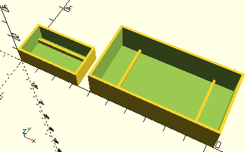

# FrameRails

Erzeugt zwei Stege in einem mit [__Frame__](Frame.md) erzeugten Rahmen. Die Stege sind mit Abstand mittig plaziert und können von rechts nach links oder vorne nach hinten verlaufen.

## Use
```
use <../ModelBase/Simple.scad>
```

## Syntax
```
FrameRails(
  volume,
  distance=getStudRailDistance(),
  height=getStudHeight() + getStudTolerance(),
  direction=Horizontal, 
  tolerance=getTolerance());
```

| Parameter | Typ | Beschreibung |
| ------ | ------ | ------ |
| volume | \[x,y,z] | Länge x Breite x Höhe des Innenraums. Auf Länge und Breite wird noch der Wert von *tolerance* für das tatsächliche innere Volumen gerechnet. |
| distance | Decimal | Abstand der Stege, gerechnet von den beiden inneren Rändern. Standard ist [__getStudRailDistance__](getStudRailDistance.md), damit Zapfen dazwischen passen.|
| height | Decimal | Höhe der Stege. Standard ist [__getStudHeight__](getStudHeight.md) plus [__getStudTolerance__](getStudTolerance.md). |
| direction | Boolean | Richtung der Stege: __Vertical__ (__true__) oder __Horizontal__ (__false__) |
| tolerance | Decimal | Toleranzwert, der zu Länge und Breite gerechnet wird, damit in das gedruckte Element das Bauteil hineinpasst. Standard ist [__getTolerance()__](../Base/getTolerance.md). |

## Beispiel
```
use <../../ModelBase/Simple.scad>

include <../../Base/PlacementOptions.scad>

distance = 8.9;
height = 2.7;
volume = [30, 15, 10];

Frame(volume);
FrameRails(volume, distance, height);

translate([40, 0]) {
    biggerVolume = [60, 30, 15];
    Frame(biggerVolume);
    FrameRails(biggerVolume, distance + 30, height, Vertical);
}
```

