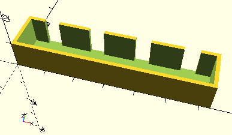

# FrameTopCutoffs

Erzeugt mehrere Kubus, die mit __difference__ Ausschnitte mit gleichmäßigem Abstand in der oberen Wand eines mit [__Frame__](Frame.md) erzeugten Rahmens schneidet.

## Use
```
use <../ModelBase/Simple.scad>
```

## Syntax
```
FrameTopCutoffs(
  volume, 
  count, 
  cutoffWidth);
```

| Parameter | Typ | Beschreibung |
| ------ | ------ | ------ |
| volume | \[x,y,z] | Länge x Breite x Höhe des Inneraums. Auf Länge und Breite wird noch der Wert von *tolerance* für das tatsächliche innere Volumen gerechnet. |
| count | Integer | Zahl der Ausschnitte. |
| cutoffWidth | Decimal | Breite jedes Ausschnitts. |

## Beispiel
```
use <../../Base/Constants.scad>
use <../../ModelBase/Simple.scad>

width = 15;
count = 4;
cutoffWidth = 5;
tolerance = 1;

difference() {
    volume = [width * count,10,10];
    Frame(volume, tolerance);
    FrameTopCutoffs(volume, count, cutoffWidth, tolerance);
}
```

