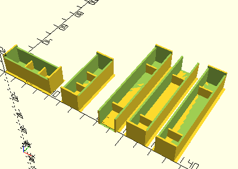

 # GearRack

Erzeugt einen Rahmen für Hubzahnstangen.

Die Rahmen für Hubzahnstangen haben innen Stege.

## Use
```
use <../ModelBase/Complex.scad>
```

## Syntax

```
GearRack(
    width=30, 
    dock=false);
```

| Parameter | Typ | Beschreibung |
| ------ | ------ | ------ |
| width | Decimal | Basislänge der Hubzahnstange ohne die Metallstifte. Sinnvolle Werte sind 30 und 60. |
| dock | Boolean | __true__ wenn die linke Seite des Rahmens an die Wand gedockt werden soll. Der Rahmen ist dann nach links offen und der X-Nullpunkt ist um die Wandstärke nach rechts verschoben. |

## Beispiel
```
use <../../Base/Placement.scad>
use <../../ModelBase/Complex.scad>

include <../../Base/PlacementOptions.scad>

GearRack();

Place(50, 0, getGearRackSpace(), rotation=Rotate90)
    GearRack();

Place(80, 0, getGearRackSpace(60, true), rotation=Rotate270)
    GearRack(60, true);

Place(100, 0, getGearRackSpace(60, true), rotation=Rotate90)
    GearRack(60, true);

Place(120, 0, getGearRackSpace(60), rotation=Rotate90)
    GearRack(60);
```

