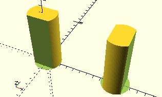

# LockingAxis

Erzeugt eine stehende Achse für Rastachsenkupplungen.

Auf diese Achse können Elemente mit einer Rastachsenkupplung gesteckt werden, die bis zu 30 mm lang sind.

## Use
```
use <../ModelBase/Simple.scad>
```

## Syntax
```
LockingAxis();
```

## Beispiel

```
use <../../ModelBase/Simple.scad>

LockingAxis();

Place(10, rotation=Rotate90)
    LockingAxis();
```

