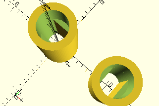

# LockingTube
Stehender Tubus für eine Rastachse bis zu 30 mm. Der Tubus wird i.d.R. für die Achse 31082 mit Z28 verwendet, die für das Stufengetriebe des Mini-Motor bzw. XS-Motors gedacht ist.

Der Nullpunkt der Koordinaten ist, wie bei allen Zylindern, die Mitte des Zylinders. Für Elemente sollte deswegen der __LockingTube__ noch auf der gewünschten Fläche zentriert werden.



## Use
```
use <../Elements/LockingTube.scad>
```

## Syntax
```
LockingTube(
    height=12);
```

| Parameter | Typ | Beschreibung |
| ------ | ------ | ------ |
| height | Decimal | Höhe des Tubus. Mehr als 30 mm sind nicht zu empfehlen, da die nutzbare Höhe des Sortierkastens nur etwa 40 mm beträgt. |

## Rückgabewert getLockingTubeSpace
Fläche als \[x,y]-Liste