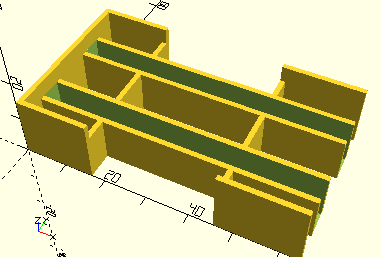

# RackBase

Erzeugt den Rahmen für Zahnstangen.

Diese Rahmen können auch inn der 30 und 60 mm Variante kombiniert werden, dass für 30 und 60 mm Zahnstangen zusammengefügt werden, wie in mot2.

Durch Andocken (*alignX* oder *alignY*) werden die Stege jeweils so verlängert, dass sie mit der jeweiligen Wand verschmelzen.

Die vorgefertigten Elemente [__FrameRack30__](../Elements/FrameRack30.md) und [__FrameRack60__](../Elements/FrameRack60.md) geben den jeweiligen *factor* vor und setzen *frame* immer auf __true__. [__FrameRack__](FrameRack.md) gibt lediglich *frame* mit __true__ vor.

## Use
```
use <../ModelBase/Complex.scad>

include <../Base/PlacementOptions.scad>
```

## Syntax
```
RackBase(
    factor=1, 
    count=1, 
    alignX=NoAlign, 
    alignY=NoAlign,
    frame=false)
```

| Parameter | Typ | Beschreibung |
| ------ | ------ | ------ |
| factor | Decimal | 1 für 30 mm Zahnstangen, 2 für 60 mm Zahnstangen. |
| count | Integer | Anzahl der nebeneinander liegenden Zahnstangen. |
| alignX | Integer (Enum) | __NoAlign__ wenn der Rahmen nicht mit einer Wand verschmolzen werden soll. __AlignLeft__, wenn die linke Seite (vor einer eventuellen Drehung) an eine Wand gedockt werden soll, und __AlignRight__ für das Andocken rechts. |
| alignY | Integer (Enum) | __NoAlign__ wenn der Rahmen nicht mit einer Wand verschmolzen werden soll. __AlignBottom__, wenn die untere Seite (vor einer eventuellen Drehung) an eine Wand gedockt werden soll, und __AlignTop__ für das Andocken oben. |
| frame | Boolean | __true__ erzeugt einen leicht erhöhten Rahmen um dem inneren Rahmenm |

## Beispiele

### Einfache Rahmen
```
use <../../Base/Placement.scad>
use <../../Base/Constants.scad>
use <../../ModelBase/Complex.scad>

include <../../Base/PlacementOptions.scad>

RackBase();

Place(40, 0, getFrameRackSpace(2), rotation=Rotate90)
    RackBase(2);

Place(80, 0, getFrameRackSpace(2, 2), rotation=Rotate90)
    RackBase(2, 2);

Place(120, 0)
    RackBase(1, 4);
```


### Links und rechts angedockt
```
use <../../Base/Placement.scad>
use <../../Base/Constants.scad>
use <../../ModelBase/Complex.scad>

include <../../Base/PlacementOptions.scad>

Place(0, 0) {
    RackBase(2, 2, alignX=AlignLeft);
}

Place(0, 50) {
    RackBase(2, 2, alignX=AlignRight);
```


### Oben und unten angedockt
```
use <../../Base/Placement.scad>
use <../../Base/Constants.scad>
use <../../ModelBase/Complex.scad>

include <../../Base/PlacementOptions.scad>

Place(0, 0) {
    RackBase(2, 2, alignY=AlignBottom);
}

Place(0, 50) {
    RackBase(2, 2, alignY=AlignTop);
```


### Rechts angedockt mit Rahmen
```
use <../../Base/Placement.scad>
use <../../Base/Constants.scad>
use <../../ModelBase/Complex.scad>

include <../../Base/PlacementOptions.scad>

RackBase(2, 2, alignX=AlignRight, frame=true);
```

Der Rahmen wird an den Seiten weggelassen, an denen das Element im Kasten angedockt wird. Der Rahmen selbst hat Lücken an den Stirnseiten, damit man die Zahnstangen greifen kann. Dies entspricht dem Design, wie es im Kasten mot3 verwendet wird.


