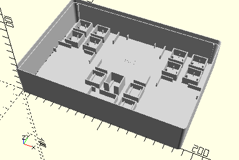

# Beispiele für Sortierkästen

Es gibt zwei Arten von Beispielkästen, die sukzessive erweitert werden:
- Nachgebaute Originalkästen
- Neue Entwürfe

## Nachgebaute Originalkästen

Verzeichnis: BuildingKits/*group*

Gruppen sind z.B. Baukastenreihen wie ec (Elektronik) oder mot (Motoren)

## Kompletter Kasten oder Inlay

Die Kästen ec1-ec3 wurden so modifiziert, dass sie als komplette Kästen oder Inlays für die Box-1000-Sortierkästen generiert werden können. Die Auswahl erfolgt über den OpenSCAD-Customizer:

### ec1 als Inlay


### ec1 komplett


### Auswahl im Customizer


### Was zu beachten war

Zunächst muss eine boolsche Variable eingeführt werden. Ein sinnvoller Name dafür ist *inlay*:

```
/* [Box Parameters] */
// Complete box (false) or inlay for empty box (true)
inlay = false;
```

Ebenfalls sinnvoll ist das Ausblenden von weiteren internen Variablen durch diese Kommentarzeile:

```
/* [Hidden] */
```

Um den kompletten Kasten durch ein Inlay auszutauschen muss man lediglich diese Sequenz verwenden:

```
if (inlay) {
    Box190Inlay();
} else {
    Box190();
    BoxWeb(LowerLeft, RightOfCorner, 15.2);
    BoxWeb(LowerRight, LeftOfCorner, 15.2);
    BoxWeb(UpperRight, RightOfCorner, 5);
    BoxWeb(UpperLeft, LeftOfCorner, 5);
}
```

Dadurch werden auch die Stege entfernt.

Falls man, wie beim ec1, auch Elemente verwendet, die sich an die Wand andocken, muss man weitere Änderungen einbauen. Beim ec1 war das der Rahmen für die Kassette oben, sowie die beiden links und rechts angedockten Rahmen für Relais und Gleichrichter. Diese beiden Elemente ([__FrameCassette__](Elements/FrameCassette.md) und [__FrameElectronicBlock__](Elements/FrameElectronicBlock.md)) rücken sich automatisch etwas von den Wänden ab und generiern Stege, wenn sie gedockt werden. Das muss man bei *inlay* = __true__ ausschalten:

```
    FrameElectronicBlock(alignX=inlay ? NoAlign : AlignLeft, alignY=inlay ? NoAlign : AlignBottom);
```

Beim Docken am linken (__AlignLeft__) oder unteren Rand (__AlignBottom__) muss man außerdem beim Platzieren berücksichtigen, die Differenz des zusätzlichen Platzes für den Docking-Abstand zu x bzw. y zu addieren. Dadurch bleiben die Rahmen auch ohne Abstand und Stege an der vorgesehenen Position:

```
xInlayDiff = inlay ? 
    (getFrameElectronicBlockSpace(alignX=AlignRight, alignY=AlignBottom).x - getFrameElectronicBlockSpace().x) : 
    0;
yInlayDiff = inlay ? 
    (getFrameElectronicBlockSpace(alignX=AlignRight, alignY=AlignBottom).y - getFrameElectronicBlockSpace().y) : 
    0;
Place(xInlayDiff, yInlayDiff)
    FrameElectronicBlock(alignX=inlay ? NoAlign : AlignLeft, alignY=inlay ? NoAlign : AlignBottom);
```

Beim ec3 laden Wände genau auf der Höhe der Stege der Sortierboxen des Kastens 1000. Deswegen mussten sie um einen Offset von -1,8 mm nach innen versetzt werden. Auch das muss beachtet werden, wenn man die Kästen für Inlays modifiziert.

In zukünftigen Versionen soll das noch besser unterstützt werden. Zunächst soll aber noch an weiteren Kästen geprüft werden, welche Auswirkungen durch *inlay*-Varianten auftreten können.