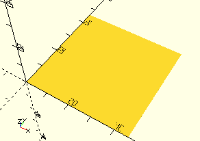

# Wie konstruiere ich ein Element für Bauteile?
Im folgenden Tutorial erfährt man
- was man braucht
- wie man startet
- wie man konstruiert
- wie man dokumentiert

## Was brauche ich?
- Computer
- [OpenSCAD](https://openscad.org/) - gibt's für alle größeren Betriebssysteme und experimentell auch schon über WebAssembly im Browser
- [Kenntnisse](https://openscad.org/documentation.html#tutorial) der SCAD-Sprache
- Download oder Fork [dieser Bibliothek](https://github.com/proggi64/fischertechnik-box-foundation) auf dem lokalen Computer
- Optional: Schieblehre zum exakten Ausmessen von Teilen
- Optional: [Visual Studio Code](https://code.visualstudio.com/?wt.mc_id=DX_841432) als Editor und die Erweiterungen [scad](https://marketplace.visualstudio.com/items?itemName=efbenson.scad) und [Markdown Preview Github Styling](https://marketplace.visualstudio.com/items?itemName=bierner.markdown-preview-github-styles).

Ich verwende Visual Studio Code als Editor, weil
- der Editor komfortabler als der von OpenSCAD ist
- alles automatisch in Git über die Quellcodeverwaltung gebunden ist (direkt auf GitHub)
- die Dokumentation per Markdown und Vorschau komfortabel integriert werden kann
- für SCAD und Markdown eigene Code-Snippets die Tipparbeit minimieren (siehe Ordner __VS Code Snippets__)
- mit dem zweiten Monitor OpenSCAD "live" 

## Erste Schritte: Halterung für Winkelachse
Ziel des Tutorials ist die Konstruktion eines Achshalters für die Winkelachse 31035, wie sie im Kasten 50/2 vorkommt. Solche 3D-Objekte werden in diesem Projekt als __Element__ bezeichnet. Elemente können in den Sortierkästen platziert werden.


### Was kennzeichnet ein Element?
- Sie halten ein oder mehrere Bauteile oder Kombinationen davon
- Sie werden als SCAD-__module__ entworfen
- Es wird immer eine __function__ mitgeliefert, die den 2D-Flächenbedarf liefert
- Sie können einfache Parameter verwenden, z.B. Anzahlen oder Informationen für das Andocken an die Seitenwand
- Sie sollten leicht und ohne Stützstruktur mit einem 3D-Drucker druckbar sein

### Tipps für die Konstruktionsschritte
- Maße des Bauteils z.B. mit einer Schieblehre ermitteln
- Vorbilder in den "alten" Sortierkästen suchen
- Hilfsfunktionen für Grundformen im Ordner *ModelBase* kennenlernen 
- Hilfsfunktionen ür das Platzieren und Ausrichten im Ordner *Base* kennelernen
- Funktionen für Konstanten im Ordner *Base* kennenlernen
- Ähnliche Konstruktionen im Ordner *Elements* sichten

## Wir legen die Element-Datei an
Wer Elemente nicht im Github veröffentlichen will, kann beim Namen natürlich frei entscheiden. Für Elemente, die veröffentlicht werden sollen, ist allerdings die Einhaltung des Namensschemas für die Dateinamen hilfreich:

*Grundform in englisch* - *Name des Bauelements in englisch* . __scad__.

Das Ganze wird zusammengeschrieben, z.B. __FrameBracketWithAxle80.scad__ oder __CylinderHub.scad__.

Grundformen gibt es folgende:
- __Axis__: Stehende Achse, z.B. für Räder oder Naben
- __Cylinder__: Stehender Zylinder, z.B. für Reifen oder Zahnräder
- __Frame__: Rahmen, z.B. für Bausteine

Außerdem werden für komplexere Elemente noch diese Begriffe verwendet:
- __Combo__: Kombination mehrerer Elemente, z.B. für Schaufelteile oder komplette Lenkungen
- __Holder__: Halterungen, die keiner der Grundformen so richtig zuzuordnen sind

Das Schema ist kein Gesetz, sondern soll lediglich eine Orientierung darstellen.

Alle SCAD-Dateien verwenden die englischen Bezeichnungen der Bauteile im Namensschema. Diese sind nicht immer einfach herauszufinden. In den "alten" Anleitungen aus den 70ern sind viele dieser Bezeichnungen in mehreren Sprachen abgedruckt, das hilft. Ansonsten kann man auch die üblichen Übersetzer im Internet verwenden. Auch hier gilt: Es soll eine grobe Orientierung sein.

Für die Winkelachse 31035 findet man in der Anleitung des Kastens 50/3 die englische Bezeichnung "Angle Axle". Für Achshalterungen wurde bereits unvorsichtigerweise der Präfix __Frame__ verwendet (siehe z.B. [__FrameAxis50__](Elements/FrameAxis50.md)), so dass sich als Name unserer Elementdatei __FrameAngleAxis.scad__ ergibt. Axis statt Axle, weil auch hier die Entscheidung schon getroffen wurde, *axis* statt das eher britische *axle* zu verwenden.

Der Ablauf beim Anlegen der Datei hängt von verwendeten Werkzeug ab. In OpenSCAD wählt man __Datei__ | __Neu Datei__. In Visual Studio Code sollte man die ganze Bibliothek gleich über einen privaten Fork einbinden, dann kann man im Projektbaum mit der rechten Maustaste auf dem Ordner __Elements__ das Kontextmenü aufrufen und __Neue Datei__ auswählen. Die Datei ist dann automatisch auch als Änderung im Git vermerkt und kann später gepusht werden.

Im Kopf der neu angelegten Datei sollten wir gleich beschreiben, was für ein Element die Datei enthält. Dabei ist folgendes Schema hilfreich:

```
// Fischertechnik Box Library
// Frame for Angle Axis
// 31035
```

Die zweite Zeile beschreibt auf englisch den Inhalt, die dritte listet die Fischertechnik-Teilenummern auf (hier ist's nur eine).

## Was wir brauchen: Erste Use-Anweisungen
Wir beginnen am besten mit den Use-Anweisungen, die gleich zu Anfang sehr wahrscheinlich benötigt werden. In den meisten Fällen sind diese Dateien eine gute Idee:

```
use <../Base/Constants.scad>
use <../ModelBase/Simple.scad>
```

### Use Base/Constants.scad
Hier sind Standardwerte als __function__ hinterlegt, z.B. Achsdurchmesser, Wandstärken und Toleranzen. Damit spart man sich nicht nur das eigene Ausmessen dieser Werte, sondern stellt auch sicher, dass die eigenen Elemente immer mit den schon vorhandenen zusammenpassen.

Auf der [Startseite der Dokumentation](Contents.md) findet man alle diese Funktionen unter der Überschrift [Funktionen zur Ermittlung von Konstanten](Contents.md#funktionen-zur-ermittlung-von-konstanten).

### Use ModelBase/Simple.scad
Unter ModelBase/Simple.scad finden sich [einfache Basisformen](Contents.md#module-für-einfache-grundformen) und [dazu hilfreiche Funktionen](Contents.md#funktionen-zur-ermittlung-der-größe-einfacher-grundformen) für die Element-Konstruktion. Hierzu gehören u.a. Rahmen, Zylinder und stehende Achsen.

## Was wir über das Bauteil wissen sollten
Die Messung der Winkelachse ergibt folgende Werte:
- Schenkellänge: 30 mm
- Durchmesser des gebogenen Teils: 2,5 mm
- Gesamtlänge: 34,5 mm (vom einen Ende der Achse zur Rand des dazu quer stehenden Achs-Arms)

Folgende Standardwerte fließen ein:
- Durchmesser Achse: 4 mm ([__getAxisDiameter__](Base/getAxisDiameter.md))
- Höhe von Achshaltern: 15 mm ([__getFrameAxisHeight__](ModelBase/getFrameAxisHeight.md))

Aus dem Fischertechnik-Kasten 50/2 wissen wir, dass ein Steg mit 45° zwischen den zwei Achshaltern am jeweiligen End der Winkelachse den Mittelteil stützt. Auch dieser Steg ist 15 mm hoch und hat eine Aussparung, in die der gebogene Teil mit seinen 2,5 mm passt.

Für den Hinterkopf: In 50/2 sind zwei dieser Achshalter im 45°-Winkel aneinander gereiht, wobei die beiden Stege an den Biegungen zu einem Steg verschmolzen sind.

## Hintergrund: Ein bisschen 3D-Konstruktion mit OpenSCAD
Die Enden der Winkelachse sind in Rahmen gelagert, die eine Aussparung für die Achse haben. Es gibt bei der Konstruktion von Öffnungen und Aussparungen zwei Möglichkeiten:

- Man baut solche Rahmen mit vier einzelnen Wänden (__cube__) mit entsprechenden Höhen
- Man nimmt einen einfachen Rahmen und erzeugt die Aussparungen durch __difference__

In der Bibliothek wurde fast immer die zweite Variante gewählt. Das Modul [__Frame__](Modelbase/Frame.md) erzeugt dafür zwei __cube__ ineinander und zieht den kleineren vom größeren ab. __Frame__ wird als Grundlage praktisch aller Elemente verwendet, deren name mit "__Frame__" beginnt. Die Standard-Wandstärke ist der Wert von [__getDividerThickness__](Base/getDividerThickness.md).


Die Abbildung zeigt zwei __cube__ ineinander, wobei der innere hier rot-transparent dargestellt wird. Der Code unten zeigt, wie das in __ModelBase/Simple.scad__ gelöst wurde. __Frame__ kann auch jede einzelne Wand weglassen, deswegen auch der zusätzliche Code.

```
module Frame(volume, tolerance=getTolerance(), openLeft=false, openRight=false, openTop=false, openBottom=false) {
    outerVolume = getFrameOuterVolume(volume, tolerance);
    
    cutoffAdd = getDividerThickness() + getExcess();

    cutoffVolume = [
        volume.x + (openLeft ? cutoffAdd : 0) + (openRight ? cutoffAdd : 0),
        volume.y + (openBottom ? cutoffAdd : 0) + (openTop ? cutoffAdd : 0),
        volume.z];
    innerXOffset = openLeft ? 0-getExcess() : getDividerThickness()+getExcess();
    innerYOffset = openBottom ? 0-getExcess() : getDividerThickness()+getExcess();

    translate([0,0,-getExcess()]) {
        difference() {
            cube(outerVolume);
            // Remove inner and optional each specified wall
            translate([innerXOffset, innerYOffset, getExcess()])
                #cube(getFrameInnerVolume(cutoffVolume, tolerance));
        }
    }
}
```

## Erstmal aufrufbar machen
Die Schnittstelle unseres Elements besteht aus Folgendem:

- __module__ FrameAngleAxis - das 3D-Element
- __function__ getFrameAngleAxisSpace__ - liefert die Fläche des Elements

Dieses Muster gilt für alle Elemente: __module__ und __function__ entsprechen immer diesem Namensschema.

Da wir im Hinterkopf schon wissen, dass die Winkelachse nicht immer allein auftritt und eine Gruppe der Elemente ziemlich speziell angeordnet (45°) und verschmolzen ist, sollte sich um diese Anordnung am besten das Element selbst kümmern, weil hier die notwendigen Daten bekannt sind. Bei einfacheren Elementen sind Gruppen oft auch erst beim Konstruieren der Baukästen leicht zu bilden. Hier sieht es etwas anders aus. Deswegen werden wir gleich als Parameter die Anzahl der Winkelachsen mit einplanen.

Grundsätzlich machen Parameter den Einsatz schwieriger und man muss in der Dokumentation nachschauen. Deswegen sollte es gute Gründe geben, sie einzusetzen:

- Wenn Gruppen mehrerer gleicher Elemente nicht einfach zu erzeugen sind Parameter *count* oder *rows* und *columns*
- Wenn das Andocken an Seitenwände das Element selbst verändert, dann Parameter *dock* oder *alignX* und *alignY*
- Wenn man mehrere einfache Varianten in der Größe benötigt, dann Parameter *length*, *width* oder *height*.

Hilfreich und in jedem Element immer vorhanden: Ein Aufruf des Moduls am Ende der Datei, damit man in der Vorschau von OpenSCAD stets zur Kontrolle sein Element live sehen kann. daraus ergibt sich als Start folgender Inhalt:

```
// Fischertechnik Box Library
// Frame for Angle Axis
// 31035

use <../Base/Constants.scad>
use <../ModelBase/Simple.scad>

function getFrameAngleAxisSpace(count=1) = [0,0];

module FrameAngleAxis(count=1) {

}

// Test
FrameAngleAxis();
```

Wir sehen in der Vorschau jetzt noch nichts, aber beim Aktualisieren in OpenSCAD sollte auch keine Warn- oder Fehlermeldung in der Konsole erscheinen.

## Die Fläche
Die Fläche des Elements umfasst die gesamte Außenfläche, inklusive der Wandstärken von Rahmenwänden. Bei manchen Elementen, bei denen die Bauteile aus dem Rahmen herausragen, werden diese Extra-Spielräume ebenfalls in der Fläche berücksichtigt. Beim Taster ist dies z.B. der Fall, vo der Knopf des Tasters aus dem Rahmen herausragt (siehe [__FrameOushButton__](Elements/FramePushButton.md)).

Um das auch otisch zu untermalen, sollte die gesamte Grundfläche mit dem Modul [__Space__](ModelBase/Space.md) unterlegt werden. __Space__ erzeugt eine dünne Schicht, die später beim Platzieren automatisch in den Boden des Kasten gesenkt wird. Das vermeidet minimale Luftspalte in den 3D-Modellen, die durch Rundungsfehler entstehen können.

Der minmale Platz, den unsere Winkelachse benötigt, ist deren Gesamtlänge (also 34,5 mm) im Quadrat. Dazu müssen wir aber mindestens noch zwei Wandstärken rechnen. Die Rahmen, die die Achse halten, sind mit solchen Wänden eingerahmt.

Prinzipiell würde das reichen. Dennoch kann man am Vorbild im Kaste 50/3 sehen, dass noch etwas zusätzlicher Raum zwischen den im 45°-Winkel aneinanderliegenden Haterungen liegt. Die Messung ergibt hier zusätzliche 1,8 mm nach links und nach unten. Das muss nicht so präzise nachgebaut werden, aber wenn wir diesen Wert schon haben, verwenden wir ihn auch.

### width, depth

Die Variablen- und Parameternamen für Breite, Tiefe und Höhe lauten durchgängig in der Bibliothek *width* (X-Achse), *depth* (Y-Achse) und *height* (Z-Achse). In den Element-Dateien werden die Werte dafür i.d.R. als Variablen vor den __function__- und __module__-Definitionen festgelegt:

```
width = 34.5;
depth = 34.5;
extra = 1.8;
```

Wie man sieht, sind in *width* und *depth* weder Wandstärken, noch die zusätzliche Distanz eingerechnet. *distance* wurde als eigene Variable definiert.

Regel: *width* and *depth* sollen die Fläche des Bauteils angeben.

Das liegt daran, dass mit [__getDividerWidth__](Base/getDividerThickness.md) und [__getTolerance__](Base/getTolerance.md) die zu addierenden Werte über __Constants.scad__ ermittelt werden sollen. Die meisten Bibliotheksmodule und -funktionen erwarten die Bauteilgrößen und addieren intern diese Werte erst dazu. Dadurch wird es viel leichter, zentral Änderungen durchzuführen, wenn sich z.B. die Toleranzwerte als nicht optimal erweisen. Die Bauteilgrößen ändern sich sicher nicht mehr.

### Complex.scad liefert Hilfe

Jetzt müssen wir __getFrameAngleAxisSpace__ noch beibringen, den richtigen Wert zurück zuliefern: Wandstärken und Toleranz, sowie die zusätzlichen 1,8 mm müssen zur Bauteilgröße addiert werden.

Für die Fläche ist es unerheblich, dass es sich um eine um 90° geknickte Achse handelt. Wir können also die Fläche mit der Annahme angeben, dass eine 34,5 mm x 34,5 mm große Platte im Rahmen Platz finden muss. Und für diesen Fall gibt's eine vorgefertige Funktion namens [__getFrameOuterVolume__](ModelBase/getFrameOuterVolume.md). Diese Funktion liefert eine Liste aus drei Werten für X-, Y- und Z-Ausdehnung, eben das Volumen. Eingerechnet sind da schon die Wandstärken und die Toleranz.

Da wir auch eine Höhe als Eingangswert benötigen, der aber für die Fläche nicht relevant ist, können wir einen beliebigen Wert angeben. Trotzdem wäre hier die Standardhöhe der Achshalter keine schlechte Idee. Um an die heranzukommen, brauchen wir noch eine weitere __use__-Anweisung:

```
use <../ModelBase/Complex.scad>
```

### Parameter *count* beeinflusst das Ergebnis

Jetzt kommt noch der Parameter *count* ins Spiel. Bei fast allen Elementen kann man bei der Berechnung der Fläche für mehrere Bauteile mit einfacher Multiplikation der Einzelfläche arbeiten. Hier wäre das falsch: Die Winkelachsen werden im 45°-Winkel relativ eng ineinander geschachtelt. Wir benötigen also die Breite der Achshalter plus 1,8 mm Extra-Platz, damit wir korrekt rechnen. Ein Blick in die Datei __ModelBase/Complex.scad__ bzw. die Dokumentation liefert uns die notwendige Funktion: [__getFrameAxisSpace__](Modelbase/getFrameAxisSpace.md). Der y-Wert entspricht der Breite zweier Wände plus des Durchmessers einer Achse (plus etwas Toleranz).

Wie erwähnt, wollen wir die Fläche gleich auch noch mit [__Space__](ModelBase/Space.md) darstellen, was uns die erste optische Rückmeldung in OpenSCAD beschwert. So sieht alles zusammen aus:

```
// Fischertechnik Box Library
// Frame for Angle Axis
// 31035

use <../Base/Constants.scad>
use <../ModelBase/Simple.scad>
use <../ModelBase/Complex.scad>

width = 34.5;
depth = 34.5;
extra = 1.8;

function getFrameAngleAxisSpace(count=1) = getFrameOuterVolume([
    width + extra + (count-1)*(getFrameAxisSpace().y + extra), 
    depth + extra + (count-1)*(getFrameAxisSpace().y + extra), 
    getFrameAxisHeight()]);

module FrameAngleAxis(count=1) {
    Space(getFrameAngleAxisSpace(count));
}

// Test
FrameAngleAxis();
```

### Hintergrund: Parameter von getFrameOuterVolume
Bei der großen Mehrheit der Elemente ist die Berechnung der Fläche trivial. In unserem Beispiel ist sie zwar keine Raketentechnik, bedarf aber einiger Erklärungen.

[__getFrameOuterVolume__](ModelBase/getFrameOuterVolume.md) benötigt eine Liste aus drei Werten für X-, Y- und Z-Wert. Die werden in OpenSCAD in eckigen Klammern mit Kommas getrennt angegeben.

Wir verwenden den Parameter *count* für die Anzahl der Winkelachsen. Bei nur einer (*count* = 1) entspricht die Fläche den 34,5 mal 34,5 mm plus den Wänden und der Toleranz. Mit jeder weiteren Achse wird aber nur die Breite des Achshalters plus die 1,8 mm Extra-Abstand dazugerechnet. Deswegen wird erst ab *count* = 2 dieser Betrag zu Breite und Tiefe dazugezählt.

Die Funktion [__getFrameAxisSpace__](ModelBase/getFrameAxisSpace.md) arbeitet mit einer Standard-Achlänge von 30 mm für ihren optionalen Parameter *length*. Da wir nur die Breite (y) benötigen, ist die Länge nicht wichtig und wir können den Parameter weglassen.

In der Vorschau von OpenSCAD kann man das Verhalten prüfen, wenn man beim Testaufruf Werte größer 1 übergibt:

#### count = 1


#### count = 2



#### count = 3


## Jetzt die Achshalter
Auch hier ist es eine gute idee, sich die Funktionen und Module anzuschauen, die in der Bibliothek vorhanden sind. Für Achsen wurde das Basismodul [__FrameAxis__](ModelBase/FrameAxis.md) entwickelt. In dessen erster Version wurden nur Achshalter für eine gerade Achse mit Haltern an beiden Enden unterstützt. Im Rahmen der Entwicklung dieses Tutorials kam die Anforderung auf, auch einen einzelnen Achshalter für nur ein Ende der Achse zu erzeugen. Durch einen weiteren optionalen Parameter war dies relativ einfach zu implementieren: Parameter *single* muss jetzt nur auf __true__ gesetzt werden, dann wird nur eine Seite erzeugt. Außerdem kann man in diesem Fall den Parameter *length* weglassen. Jetzt erzeugen wir einfach zwei einzelne Halter im 90°-Winkel an den richtigen Stellen.

Beginnen wir mit dem ersten Achshalter. Der Extra-Platz von 1,8 mm muss als Einrückung vom linken Rand angegeben werden. Dafür wollen wir statt __translate__ gleich das Bibliotheksmodul [__Place__](Base/Place.md) einsetzen. Die Bibliothek liefert für die Platzierung von Objekten auf Flächen eine Reihe von Funktionen und Modulen. In der Hilfe findet man sie unter [__Module zur Platzierung von Elementen__](Contents.md#module-zur-platzierung-von-elementen). Diese Funktionen und Module arbeiten normalerweise mit dem Sortierkasten 190 x 130 mm als Grundfläche. Über optionale Parameter funktioneren sie aber auf beliebigen Flächen.

Dafür benötigen wir noch die Datei __Base/Placement.scad__. Eine weitere __use__-Anweisung importiert sie in unser Element.

```
use <../Base/Placement.scad>
```

In der Dokumentation des [__Place__](Base/Place.md)-Moduls finden wir Konstanten mit sprechenden Namen für die Drehung ud Ausrichtung. Diese befinden sich alle in der Datei __Base/PlacementOptions.scad__. Hier müssen wir statt __use__ allerdings __include__ verwenden. Die dort definierten Variablen importiert __use__ nicht. __include__ importiert diese, als wenn sie Bestandteil unserer eigenen SCAD-Datei wären. Nur so funktioniert es:

```
include <../Base/PlacementOptions.scad>
```

### Platzieren mit Place
Jetzt platzieren wir nur noch den ersten Achshalter. Der optionale Parameter *x* gibt den X-Wert an. in unserem Fall ist dies der Extra-Abstand *extra*, den wir für weitere Winkelachsen reservieren wollen:

```
    Place(x=extra)
        FrameAxis(single=true);
```


Man sieht, dass es keine einfache Grundform ist, aber für alle möglichen Arten von Achshalterungen zum Einsatz kommen kann. Die Konstruktion hat uns die Bibliothek abgenommen, der Aufruf war ziemlich trivial. Die Länge *partLength* wird auch hier verlangt, aber nicht verwendet, da ja nur ein einzelner Halter generiert wird.

### Drehen und Ausrichten mit Place
Jetzt brauchen wird dasselbe, nur gedreht und am rechten Rand des Rechtecks. Auch das kann [__Place__](Base/Place.md) erledigen, allerdings mit einer Reihe zusätzlicher Parameter:

```
    spaceWithoutExtra = getFrameOuterVolume([
        width,
        depth,
        getFrameAxisHeight()
    ]);

    Place(
        elementSpace=[spaceWithoutExtra.x, getFrameAxisSpace().y], 
        boxSpace = getFrameAngleAxisSpace(),
        alignX = AlignRight,
        rotation = Rotate90)
        FrameAxis(single=true);
```

[__Place__](Base/Place.md) kann viel, muss aber dafür auch mit genug Daten versorgt werden. Hier wollen wir gleich zwei Dinge:
- Drehe das Teil um 90°
- Richte es am rechten Rand aus

Dazu braucht __Place__ zwei Flächen:
- Die Fläche, auf der ausgerichtet werden soll (*boxSpace*)
- Die Fläche des Teils, das gedreht und ausgerichtet werden soll (*elementSpace*)

*boxSpace* ist in diesem Fall identisch mit dem Ergebnis, das unsere Funktion __-_getFrameAngleAxisSpace()__  liefert. Wir müssen auch, anders als bei der X-Achse, nicht den *extra*-Offset angeben, weil der oben in der Y-Achse ist und die Y-Position 0 deswegen passt.

*elementSpace* müssen wir neu ermitteln, den legen wir in der Variablen *spaceWithoutExtra* ab. Dort wird der Platz errechnet, der für einen Zweig unserer Winkelachse für die Halterung benötigt wird. Zur Ermittlung der Breite des Achshalters rufen wir wieder [__getFrameAxisSpace__](ModelBase/getFrameAxisSpace.md) auf, benötigen aber am Ende nur dessen y-Wert.

## Fast fertig

Keine Angst: Beim Erstellen des Tutorials klappte auch nicht alles wie gewünscht sofort. Ausprobieren und Fehler bereinigen ist, wie beim Programmieren, immer ein großer Bestandteil der Arbeit. Eine große Hilfe ist immer die Vorschau von OpenSCAD. Am besten bei jedem Schritt prüfen, ob's noch tut.

Schauen wir uns das Zwischenergebnis an:

```
// Fischertechnik Box Library
// Frame for Angle Axis
// 31035

use <../Base/Constants.scad>
use <../Base/Placement.scad>
use <../ModelBase/Simple.scad>
use <../ModelBase/Complex.scad>

include <../Base/PlacementOptions.scad>

width = 34.5;
depth = 34.5;
extra = 1.8;

function getFrameAngleAxisSpace(count=1) = getFrameOuterVolume([
    width + extra + (count-1)*(getFrameAxisSpace().y + extra), 
    depth + extra + (count-1)*(getFrameAxisSpace().y + extra), 
    getFrameAxisHeight()]);

module FrameAngleAxis(count=1) {
    Space(getFrameAngleAxisSpace(count));
    
    Place(x=extra)
        FrameAxis(single=true);
    
    spaceWithoutExtra = getFrameOuterVolume([
        width,
        depth,
        getFrameAxisHeight()
    ]);

    Place(
        elementSpace=[spaceWithoutExtra.x, getFrameAxisSpace().y], 
        boxSpace = getFrameAngleAxisSpace(),
        alignX = AlignRight,
        rotation = Rotate90)
        FrameAxis(single=true);
}

// Test
FrameAngleAxis();
```

Und das Ergebnis in der Vorschau:


## Der schräge Steg fehlt noch


