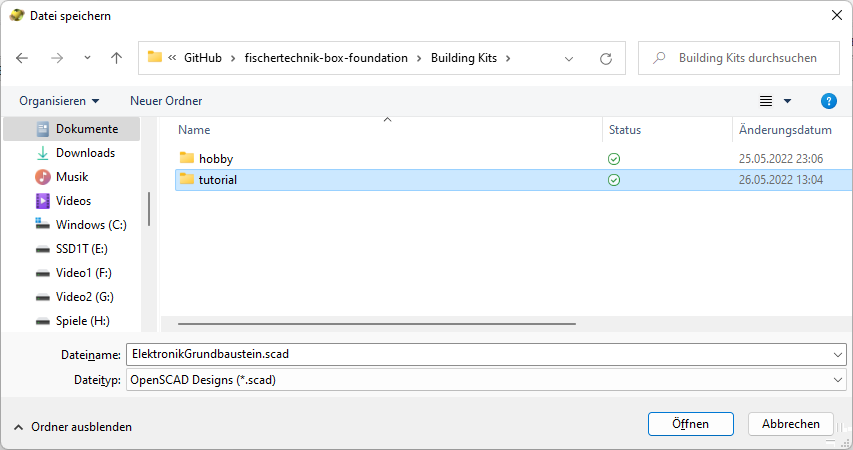
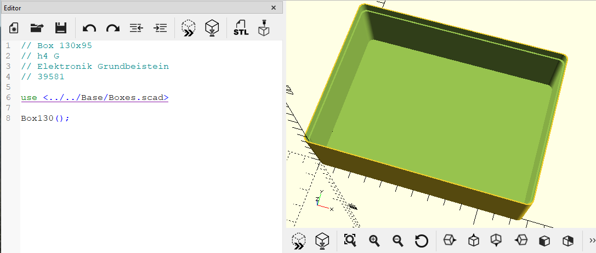
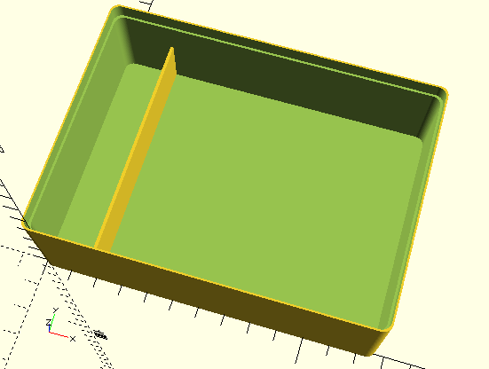
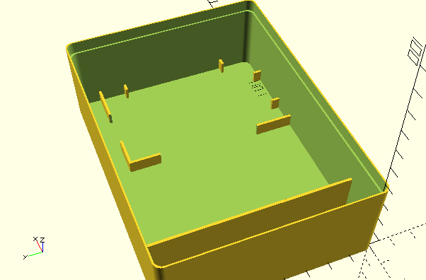
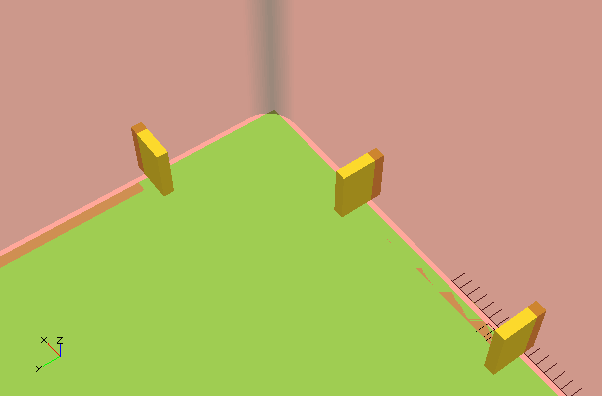
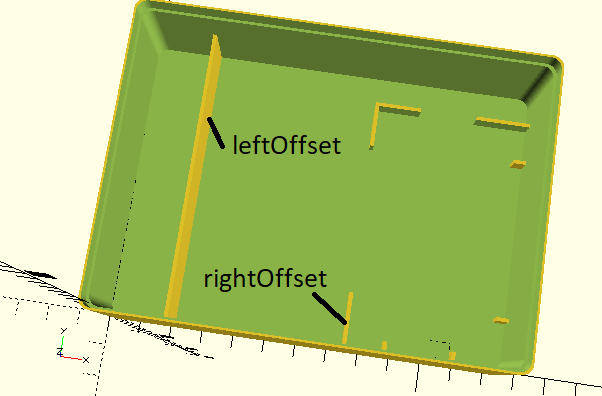
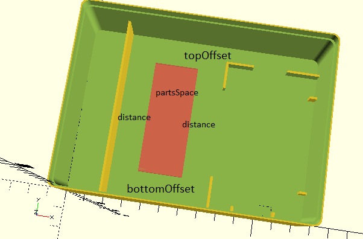

# Wie konstruiere ich einen Sortierkasten?
Im folgenden Tutorial erfährt man
- was man braucht
- wie man startet
- wie man Elemente platziert

## Was brauche ich?
- Computer
- [OpenSCAD](https://openscad.org/) - gibt's für alle größeren Betriebssysteme und experimentell auch schon über WebAssembly im Browser
- [Kenntnisse](https://openscad.org/documentation.html#tutorial) der SCAD-Sprache
- Download oder Fork auf dem lokalen Computer [dieser Bibliothek](https://github.com/proggi64/fischertechnik-box-foundation)
- 3D-Drucker mit mindestens 20 x 14 cm Druckfläche (oder 3D-Druck-Dienstleister)

## Erste Schritte: Eine kleine Box für den Elektronik-Grundbaustein
Ziel des Tutorials ist der Bau eines 130 x 95 kleinen Sortierkastens, in den der Silberling mitsamt Verbindungsstecker, Drehknopf, zwei Kontrollleuchten und einigen Kleinteilen Platz findet. Der Kasten ist nur halb so groß wie ein Standardeinsatz im Fischertechnik-Kasten 1000. Wenn man den stapeln will, hat man daneben noch Platz für einen zweiten.


Falls man sein Ergebnis hier auf GitHub veröffentlichen will: Der Platz für Eigenentwürfe ist im Ordner __Building Kits__ vorgesehen. Die relativen Pfade bei den __use__-Anweisungen gehen davon aus, dass die Dateien dort in einem weiteren Unterverzeichnis stehen. Das Beispiel hier existiert bereits im Unterverzeichnis __hobby__ als __h4 GB.scad__.

### Neue SCAD.Datei
Wir legen die SCAD-Datei an und speichern sie.

- OpenSCAD starten
- __Datei__ | __Neue Datei__
- Optional: Kommentarzeilen, die die Box identifizieren

```
// Box 130x95
// h4 G
// Elektronik Grundbeistein
// 39581
```

- __Datei__ | __Datei speichern__

)

Erst nach dem Speichern können die Pfade der noch folgenden __use__-Anweisungen aufgelöst werden, damit wir ein Vorschaubild unseres Kastens sehen können.

Wenn wir die Datei wie hier im Beispiel innerhalb der Pfadstruktur der Bibliothek anlegen (hier __tutorial__), bauen wir automatisch eine Kopplung an GitHub auf, d.h. wir können unser Beispiel auch ins Git pushen, falls wir einen Fork statt eines Downloads verwenden. Wem das zu kompliziert ist, dem sei empfohlen, einfach die Bibliothek per Download zu holen.

### Der Basiskasten
Wir legen den Basiskasten 130 x 95 an. Dieser ist die halb so große Version der acht Standard-Sortierkästen aus der Box 1000. Für unseren Silberling reicht das, für alle größeren gibt's die [__Box190__](Base/Box190.md).

- per __use__ Base/Boxes.scad importieren
- [__Box130__](Base/Box130.md) aufrufen, um diesen Grundkasten als Element zu verwenden

```
use <../../Base/Boxes.scad>

Box130();
```

Die leere Box wird so platziert, dass die Oberfläche des Bodens exakt auf Höhe 0 liegt. Der verwendbare Bereich liegt an X/Y-Position 0,0, so dass man die Wände bei der Positionierung nicht berücksichtigen muss.

)

### Für die Kleinteile
Wir erzeugen eine Trennwand für den Bereich, in den später die Kabel, der Kondensator und der Widerstand Platz finden.

- per __use__ ModelBase/Simple.scad importieren
- mit [__Divider__](ModelBase/Divider.md) die Trennwand erzeugen

```
use <../../Base/Boxes.scad>
use <../../ModelBase/Simple.scad>

Box130();

boxSpace=getBox130Space();
dividerWidth = 20;

Divider(dividerWidth, boxSpace=boxSpace);
```

)

Zumeist ist es eine gute Idee, konstante Werte Variablen zuzuweisen. Wir brauchen diese später noch an anderen Stellen, deswegen werden hier *boxSpace* und *dividerWidth* zugewiesen, bevor sie __Divider__ übergeben werden.

Zwei Anmerkungen zu SCAD:

"Variablen" sind nicht variabel. Sie können nicht wie in den prozeduralen Sprachen Java oder C verändert werden. Stattdessen bekommen sie den zuletzt zugewiesenen Wert, und der gilt auch in allen Zeilen desselben Gültigkeitsbereichs zuvor. Wenn in Zeile 10 x=5 steht und in Zeile 20 x=10, dann hat x in Zeile 10 schon den Wert 10. Eine Warnung in der Konsole bei der Ausführung weist zumindest auf die überschreibende Zuweisung hin. Wenn man Variablen verändern will, muss man die __let__-Anweisung verwenden.

Optionale Parameter kann man durch Angabe des Parameternamens beim Aufruf setzen. Das passiert in unserem Beispiel, wo der Name des optionalen Parameters *boxSpace* zufällig dem der Variablen *boxSpace* entspricht. Was was ist, erkennt SCAD am Kontext, gleiche Namen sind hier also erlaubt und durchaus sinnvoll.

### Für den Silberling
Wir erzeugen einen an zwei Wände angedockten Rahmen für den Silberlink rechts vorne in der Ecke.

- per __use__ Elements/FrameElectronicBlock.scad importieren
- per __use__ Base/Placement.scad importieren
- per __include__ Base/PlacementOptions.scad importieren
- Aufruf von [__FrameElectronicBlock__](Elements/FrameElectronicBlock.md) mit den richtigen Werten
- Platzieren mit dem [__Place__](Base/Place.md)-Modul

```
use <../../Base/Boxes.scad>
use <../../Base/Placement.scad>
use <../../ModelBase/Simple.scad>
use <../../Elements/FrameElectronicBlock.scad>

include <../../Base/PlacementOptions.scad>

Box130();

boxSpace=getBox130Space();
dividerWidth = 20;
electronicBlockSpace = getFrameElectronicBlockSpace(alignX=AlignRight, alignY=AlignBottom);

Divider(dividerWidth, boxSpace=boxSpace);

Place(alignX=AlignRight, alignY=AlignBottom, 
    elementSpace=electronicBlockSpace,
    boxSpace=getBox130Space())
    FrameElectronicBlock(alignX=AlignRight, alignY=AlignBottom);
```

)

Placement.scad enthält das [__Place__](Base/Place.md)-Modul. Das kann u.a. Elemente auf Flächen ausrichten. Das verwenden wir hier, um das Element [__FrameElectronicBlock__](Elements/FrameElectronicBlock.md) in der vorderen rechten Ecke zu verankern.

Dafür benötigt __Place__ die Fläche, die das Element hat (*elementSpace*), und die Fläche, auf der ausgerichtet wird ([__getBox130Space__](Base/getBox130Space.md)). In OpenSCAD kann man das nicht über das Element ermitteln, sondern muss es explizit in einer separaten Funktion zur Verfügung stellt. jedes Element der Bibliothek hat dafür die Funktion mit den Namensschema __get*ElementName*Space()__, wobei man *ElementName* durch den tatsächlichen namend es Elements ersetzen muss. Hier verwenden wir __getframeElectronicBlockSpace()__.

Damit die Funktion __getframeElectronicBlockSpace()__ dies auch korrekt errechnen kann, benötigt es die notwendigen Parameter. Die meisten Element haben keine Parameter, so das man dort auch der Funktion keine übergeben muss. Hier verändert sich aber der Rahmen durch die Angabe, an welche Seiten angedockt werden soll, und dadurch verändert sich auch die Fläche des Elements.

Die Parameter *xAlign* und *yAlign* sind optional. Wenn der Rahmen nicht angedockt wird, fallen beide weg. Da wir hier an zwei Seiten docken, brauchen wir aber beide. Es gibt einige Elemente, die auch durch Andocken ihre Gestalt ändern, und bei allen werden dieselben Parameter verwendet. Damit man sich keine Zahlen merken muss, wurden in der Datei __Base/PlacementOptions.scad__ Variablen mit sprechenden Namen definiert, die man hier als Werte für die Variablen übergeben kann. Diese Datei muss als einzige per __include__ eingebunden werden, da __use__ keine Variablen, sondern nur Funktionen und Module importiert. Bei den Beschreibungen aller Module und Elemente, die solche Wert verwenden können, sind diese Namen dokumentiert.

Das Ergebnis: Der Rahmen für den Silberling sieht so aus, wie er auch in den ec-Kästen vorkommt. Es werden Stege als Abstandshalter zu den Wänden generiert, die mit den Außenwänden verschmelzen. Wenn man ein "#" vor [__Box130__](Base/Box130.md) stellt und dadurch die Box teilweise transparent macht, kann man diese Verschmelzung gut erkennen.

)

Einige Elemente in der Bibliothek unterstützen explizit das Andocken. Die Vorbilder dazu finden sich in den Kunststoffkästen von Fischertechnik, wie sie in den 70er Jahren geliefert wurden.

### Elemente für die Spezialteile
Ziel der Bibliothek ist es, einen umfangreichen Grundstock an Elementen zur Verfügung zu stellen. Für unseren Kasten sind die Elemente bereits alle vorhanden:

- [__FrameElectronicBlockConnector__](Element/FrameElectronicBlockConnector.md) für die Verbindungsstecker
- [__FrameControlLight__](Elements/FrameControlLight.md) für die Kontrolllämpchen
- [__AxisDial__](Elements/AxisDial.md) für die Drehknöpfe

Um auf diese Element zugreifen zu können, fügen wir oben im Code die folgenden __use_-Anweisungen ein:

```
use <../../Elements/FrameControlLight.scad>
use <../../Elements/AxisDial.scad>
use <../../Elements/FrameElectronicBlockConnector.scad>
```

### Vorbereitung der Platzierung
Jetzt müssen wir die Elemente noch platzieren. Kriterien sollten dabei sein:
- Hinreichend Platz ohne Konflikte zu benachbarten Bausteinen
- Hindernisfreier Zugriff ohne andere Bauteile herausnehmen zu müssen
- Übersichtlichkeit und eine Portion Ästhetik

Der freie Platz zwischen dem Silberling und der Trennwand links bietet sich für die Elemente an. Die Bibliothek stellt einige Module zur Verfügung, die Elemente ausrichten oder verteilen können. Prinzipiell kann man sich auch auf die mit OpenSCAD gelieferten Funktionalitäten beschränken, aber Ausrichten und Verteilen kann OpenSCAD nicht von allein.

Nachträgliche Veränderungen fallen in einigen Situationen leichter, wenn die Positionen relativ zueinander berechnet werden, anstatt sie alle absolut anzugeben. Dadurch kann die Änderung eines Wertes reichen, um eine Korrektur durchzuführen. Das muss aber nicht immer so sein. Hier muss man sich vorher die Frage stellen, wo Änderungen und Anpassungen während des Entwurfs am wahrscheinlichsten sind und welche Wirkung das haben kann.

In unserem Fall werden Position und Größe der freien Fläche mit relativen Werten bezogen auf die beiden schon platzierten Elemente berechnet. Jetzt brauchen wir noch die Datei __Base/Constants.scad__:

```
use <../../Base/Constants.scad>
```

Hier finden wir Funktionen, die Standardwerte liefern, z.B. die Stärke von Trennwänden ([__getDividerThickness__](Base/getDividerThickness.md)), den Durchmesser von Fischertechnik-Achsen ([__getAxisDiameter__](Base/getAxisDiameter.md)), die Toleranzen und eine Reihe weiterer Werte.

```
    boxSpace=getBox130Space();

    electronicBlockSpace = getFrameElectronicBlockSpace(alignX=AlignRight, alignY=AlignBottom);
```

Wie weiter oben schon gezeigt, benötigen wir die tatsächliche Fläche des Rahmens für den Silberling und stellen sie in die Variable *electronicBlockSpace*.

```
    dividerWidth = 20;
    leftOffset = dividerWidth + getDividerThickness();
    rightOffset = getBox130Space().x - electronicBlockSpace.x;
```

Auch die Breite des Fachs mit der Trennwand spielt eine wichtige Rolle und wird in *dividerWidth* gespeichert. *leftOffset* wird dann berechnet, indem zu diesem betrag noch die Stärke der Trennwand addiert wird. Ab dort beginnt der freie Platz links.

Für *rightOffset* rechnen wir die Breite des nutzbaren BEreichs des Sortierkastens und ziehen den Platz für den Rahmen des Silberlings ab. Die Stärke von dessen Trennwand ist bereits im Wert entahlten, den *electronicBlockSpace* gespeichert hat.

Damit haben wir die linke und rechte X-Position des freien Bereichs.

)

```
    distance = 15;
    bottomOffset = 15;
    topOffset = 15;

    partsSpace = [rightOffset - leftOffset - 2*distance, boxSpace.y - bottomOffset - topOffset];
```

Die Abstände zu diesen Positionen legen wir mit konstanten Werten fest und stellen sie in diese Variablen:
- *distance*: Abstand der Fläche zur linken Trennwand und rechts zum Rahmen des Silberlings
- *bottomOffset*: Abstand zur unteren Wand des Kastens
- *topOffset*: Abstand zur oberen Wand des Kastens

Damit können wir auch den Platz berechnen, der für die Teile genutzt werden soll. Dieser wird in *partsSpace* als \[x,y]-Liste abgelegt.

- *partsSpace*: Fläche, auf dem die Spezialteile platziert werden

Hilfreich für die Konstruktion ist es oft, diese Fläche über ein transparentes Rechteck sichtbar zu machen. Das kann man nach dem Platzieren wieder löschen, hilft aber für die Einschätzung und ob alles richtig gerechnetund platziert wurde:

```
partsXPosition = leftOffset + distance;
partsYPosition = bottomOffset;

Place(partsXPosition, partsYPosition) {
    #cube([partsSpace.x, partsSpace.y, 2]);
}
```

- *partsXPosition*: X-Position der Fläche
- *partsYPosition*: Y-Position der Fläche, identisch mit *bottomOffset*, aber für die Lesbarkeit...

)

Das ist also die Ausgangsposition, um die letzten Elemente zu platzieren. *partsSpace* und die Koordinaten brauchen wir beim nächsten Schritt.

Die gute Nachricht ist, dass die Bibliothek das Konstruieren der Kästen weitestgehend mit nur zweidimensionsionaler Geometrie ermöglicht. um die dritte Dimension kümmern sich die vorgefertigten Elemente.

### Verteilen der Elemente
Wir brauchen jetzt noch eine weitere __use__-Anweisung:

```
use <../../Base/Deployment.scad>
```

*Deployment.scad* liefert uns Zugriff auf die Module zur Verteilung von Elementen. Wir wollen davon das Modul [__DeploySame__](Base/DeploySame.md) verwenden.

Jetzt werden noch die drei Elemente [__FrameElectronicBlockConnector__](Elements/FrameElectronicBlockConnector.md), [__FrameControlLight__](Elements/FrameControlLight.md) und [__AxisDial__](Elements/AxisDial.md) auf der Fläche verteilt.

Wir starten mit [__FrameElectronicBlockConnector__](Elements/FrameElectronicBlockConnector.md):

```
Place(partsXPosition, partsYPosition) {
    #cube([partsSpace.x, partsSpace.y, 2]);

    DeploySame(partsSpace, getFrameElectronicBlockConnectorSpace(), rotation=Rotate90, columns=1)
        FrameElectronicBlockConnector();
```

[__DeploySame__](Base/DeploySame.md) erzeugt und verteilt das angegebene __children__-Element einmal oder mehrfach. Es hat eine Reihe optionaler Parameter. In unserem Fall wollen wir nur ein Element (*columns*=1), und dieses soll um 90° gedreht werden. Weil keine weiteren Koordinaten angegeben sind, wird das eine Element mittig unten (lokale 0-X-Position) auf der Fläche platziert.

Damit die Rotation und die Verteilung möglich sind, müssen sowohl die Fläche des Elements, wie auch die Zielfläche angegeben werden.

Alternativ kann man in unserem Fall mit dem einen Element auch [__Center__](Base/Center.md) verwenden. Durch [__DeploySame__](Base/DeploySame.md) können wir aber durch Setzen von *columns* auf 2 einfach zwei Elemente platzieren. Diese werden dann links und rechts an den Rand gestellt. Bei 3 wären die drei Elemente im gleichen Abstand verteilt. Einfach mal im Code ausprobieren.

In denselben Block setzen wir jetzt die Kontrolleuchten:
```
    CenterVertical(depth=getFrameControlLightSpace().y, space=partsSpace)
        DeploySame(partsSpace, getFrameControlLightSpace())
            FrameControlLight();
```

Standardwert für *columns* ist 2, so dass wir durch Weglassen dieses optionalen Parameters Rahmen für zwei Kontrollleuchten bekommen. Mit [__CenterVertical](Base/CenterVertical.md) sorgen wir dafür, dass das Element vertikal mittig platziert wird.

Zum Schluss noch die Achse für den Drehregler, wieder innerhalb desselben Blocks:
```
    Place(elementSpace=getAxisDialSpace(), alignY=AlignTop, alignX=AlignCenter, boxSpace=partsSpace)
        AxisDial();
```

Die Ausrichtung oben in der Fläche erledigt wieder [__Place__](Base/Place.md) mit dem Parameterwerten *alignY*=__AlignTop__ und *alignX*=__AlignCenter__.

## Ausblick
Das Beispiel mit dem Silberling ist eine vereinfachte Variante der flexibler einsetzbaren SCAD-Datei *BuildingKits/hobby/ElectronicBlockBoxBase.scad*. Bei diesem Modul kann die Anzahl der Spezialelemente jeweils als Parameter übergeben werden, so dass Kästen für Silberlinge mit 0 bis 2 Drehknöpfen oder Kontrollleuchten nur durch Parameter erzeugt werden können. Das Modul unterstützt dabei auch den Customizer von OpenSCAD, um diese Parameter dynamisch in der Oberfläche zu setzen.

Voraussichtlich werden immer wieder neue Elemente hinzukommen, aber auch komfortablere Verteil- und Platzierungsfunktionen. Am besten immer wieder mal die neue Version holen.