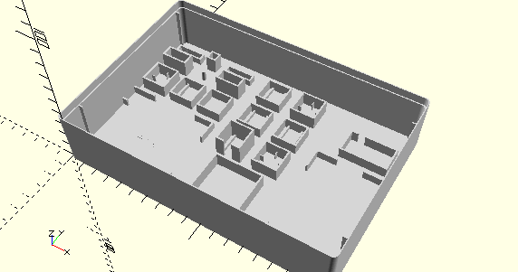

# Fischertechnik Konstruktionsbibliothek für Sortierkästen mit OpenSCAD
Die Bibliothek bietet eine sich kontinuierlich erweiternde Sammlung an parametrisierten Sortierlementen, Verteilungs- und Platzierfunktionen, sowie Basis-Sortierkästen und Einsätze für Originalkästen für das Fischertechnik-Baukastensystem. Die Kästen und Einsätze sind so entworfen, dass sie sich mit 3D-Druckern selbst herstellen lassen.

Die Bibliothek wurde inspiriert durch die Kunstoff-Sortierkästen der Fischertechnik-Baukästen der 1970er bis Anfang 1980er Jahre. Einige Beispielkästen im Verzeichnis *Original Building Kits* sind weitgehend identisch mit den Originalkästen.

Die Ziele dieser Bibliothek sind es die Konstruktion eigener Sortierkästen zu vereinfachen und eine Alternative zur CAD-Programmen zu bieten. Dennoch können die Elemente auch in CAD-Programmen verwendet werden, wenn man sie einzeln als STL-Dateien exportiert. Dafür wird bei Elementen, die Parameter benötigen, der OpenSCAD-Customizer unterstützt. Dadurch können alle benötigten Varianten gerendert und als STL-Datei exportiert werden, ohne dass OpenSCAD-Skripte geändert werden müssen.

Um die Bibliothek sinnvoll einsetzen zu können, sollte man zumindest die Grundlagen von [OpenSCAD](https://openscad.org/documentation.html) beherrschen:
- Koordinatensystem auf den X/Y/Z-Achsen
- Module und Funktionen
- Einfache Geometrie

Die Bibliothek teilt sich in folgende Gruppen:
- Base
- ModelBase
- Elements
- Test
- Original Building Kits
- Building Kits

## Base
Enthält die Basisfunktionalität der Bibliothek:
- Alignment.scad  
Funktionen für die Berechnung von Koordinaten für die Ausrichtung (Links/Oben/Rechts/Unten/Zentriert)
- Boxes.scad  
Module für den Import leerer Sortierboxen als Grundlage für jede Box
- BoxInlays.scad  
Module zum Erzeugen von bestückbaren Bodeneinlagen für Original-Fischertechnik Sortierkästen statt ganzer Kästen
- Constants.scad  
Funktionen, die konstante Werte liefern, z.B. die Wandstärke und die Toleranz
- Deployment.scad  
Module, die Elemente gleichmäßig verteilen
- Placement.scad  
Module, die Elemente platzieren und ausrichten
- PlacementOptions.scad  
Optionswerte für die Ausrichtung und Drehung, die per __include__ eingebunden werden
- Rotation.scad  
Module, die Elemente drehen

Im Base-Verzeichnis finden sich auch die STL-Dateien mit den Leerboxen 190x130 und 130x95, die als Basis zur Konstruktion verwendet werden.

## ModelBase
Enthält einfache (__Simple.scad__) und komplexere (__Complex.scad__) parametrisierbare Basiselemente, mit denen die Elemente für spezifische Bauteile erstellt werden. Diese können aber auch für individuelle Elemente für spezifische Sortierkästen verwendet werden.

## Elements
Enthält Elemente für spezifische Fischertechnik-Bauteile, einige von ihnen parametrisierbar. Alle sind auch Fischertechnik-Teilenummern zugeordnet, die in den Quelldateien als Kommentare vermerkt sind. Diese Elemente sind sofort für die Konstruktion von Sortierboxen verwendbar. Diese Sammlung wird kontinuierlich erweitert. Über die Dokumentationsseite [PartFinder](PartFinder.md) können mit der Fischertechnik-Teilenummer die passenden Elemente gefunden werden.

## Test
Enthält Testdateien für alle Module, die Funktionalität und Elemente demonstrieren. Im Unterverzeichnis __PrintTest__ befinden sich außerdem für den 3D-Druck vorbereitete SCAD-Dateien für den Testdruck jedes Elements.

## Original Building Kits
Enthält Beispiele von nachgebauten Original-Sortierkästen aus den 1970er Jahren zur Demonstration, wie Kästen konstruiert werden können. Beispielweise sind die drei Elektronikkästen ec1 bis ec3 im Unterverzeichnis ec enthalten.

## Building Kits
Enthält selbstkonstruierte Sortierkästen für Baukästen ab den 1980er Jahren. Diese sind komplette Neuentwürfe.
